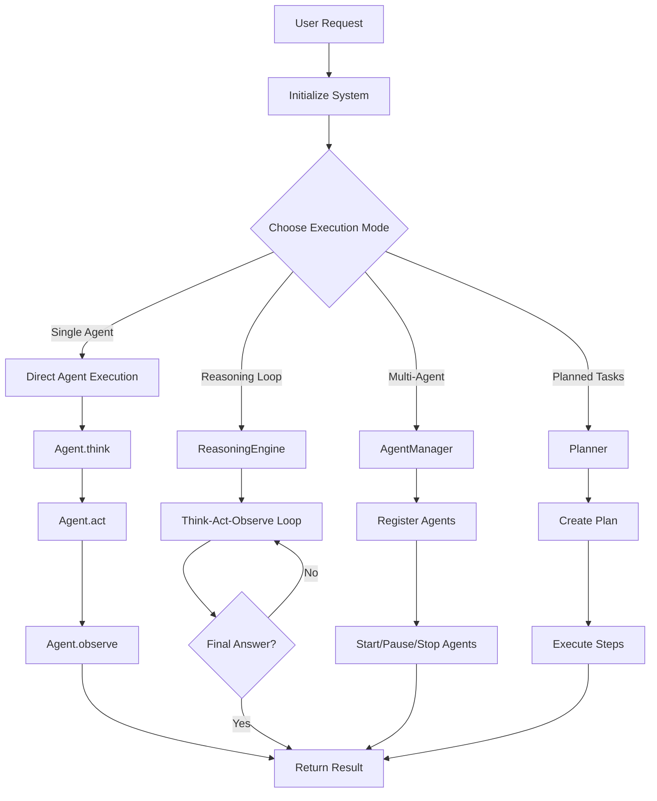
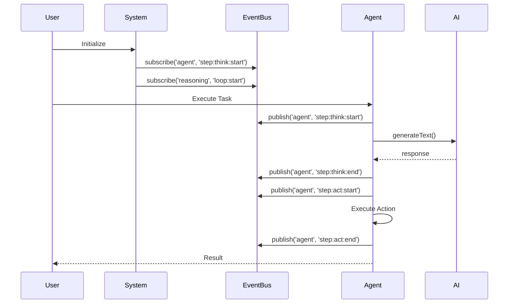

# Operone System Flow Control & Feature Timeline

This document provides a comprehensive flow control diagram showing which features are called at what time during the execution of the Operone agent system.

---

## 🔄 System Execution Flow

### High-Level Flow Diagram



---

## ⏱️ Detailed Timeline: Feature Call Sequence

### Phase 1: System Initialization (T0 - T1)

| Time | Component | Feature | Description |
|------|-----------|---------|-------------|
| T0 | **ModelProvider** | `constructor()` | Initialize AI model provider |
| T0+10ms | **ModelRegistry** | `registerProvider()` | Register OpenAI/Anthropic/Google providers |
| T0+20ms | **MemoryManager** | `constructor()` | Initialize SQLite database for memory |
| T0+30ms | **VectorStore** | `constructor()` | Initialize in-memory vector store |
| T0+40ms | **EventBus** | `getInstance()` | Get singleton event bus instance |
| T0+50ms | **EventBus** | `subscribe()` | Subscribe to system events |

### Phase 2: Agent Creation (T1 - T2)

#### OSAgent Creation
| Time | Component | Feature | Description |
|------|-----------|---------|-------------|
| T1 | **OSAgent** | `constructor()` | Create OS agent instance |
| T1+5ms | **FileTool** | `constructor()` | Initialize file operations tool |
| T1+10ms | **ShellTool** | `constructor()` | Initialize shell command tool |
| T1+15ms | **EventBus** | `publish('agent', 'created')` | Emit agent created event |

#### AssistantAgent Creation
| Time | Component | Feature | Description |
|------|-----------|---------|-------------|
| T1 | **AssistantAgent** | `constructor()` | Create assistant agent instance |
| T1+5ms | **ModelProvider** | `getEmbeddingModel()` | Get embedding model for RAG |
| T1+10ms | **RAGEngine** | `constructor()` | Initialize RAG engine |
| T1+15ms | **VectorStore** | `initialize()` | Setup vector storage |
| T1+20ms | **EventBus** | `publish('agent', 'created')` | Emit agent created event |

### Phase 3: Execution Modes

---

## 🎯 Mode 1: Direct Agent Execution

### Timeline: Single Agent Task

| Time | Component | Feature | Parameters | Events Emitted |
|------|-----------|---------|------------|----------------|
| T0 | **User** | Request | `"What files are in /tmp?"` | - |
| T0+10ms | **OSAgent** | `think()` | `input: string` | `step:think:start` |
| T0+500ms | **AI Model** | `generateText()` | `prompt, system` | - |
| T0+1500ms | **OSAgent** | `think()` returns | `thought: string` | `step:think:end` |
| T0+1510ms | **OSAgent** | `act()` | `action: string` | `step:act:start` |
| T0+1520ms | **FileTool** | `list()` | `path: string` | - |
| T0+1550ms | **OSAgent** | `act()` completes | - | `step:act:end` |
| T0+1560ms | **OSAgent** | `observe()` | - | - |
| T0+1570ms | **User** | Receives result | `result: string` | - |

**Total Duration**: ~1.6 seconds

---

## 🔁 Mode 2: ReasoningEngine Loop

### Timeline: Autonomous Reasoning

| Iteration | Time | Component | Feature | Description | Events |
|-----------|------|-----------|---------|-------------|--------|
| **Setup** | T0 | **ReasoningEngine** | `constructor()` | Create engine with max iterations | - |
| **Setup** | T0+5ms | **EventBus** | `getInstance()` | Get event bus | - |
| **Start** | T0+10ms | **ReasoningEngine** | `reason()` | Start reasoning loop | `loop:start` |
| | | | | | |
| **Iter 1** | T0+20ms | **EventBus** | `publish()` | Iteration start | `iteration:start` |
| **Iter 1** | T0+30ms | **Agent** | `think()` | Analyze situation | `step:think` |
| **Iter 1** | T0+1000ms | **Agent** | `act()` | Execute action | `step:act` |
| **Iter 1** | T0+1100ms | **Agent** | `observe()` | Get observation | `step:observe` |
| **Iter 1** | T0+1110ms | **ReasoningEngine** | `isFinalAnswer()` | Check if done | - |
| | | | | | |
| **Iter 2** | T0+1120ms | **EventBus** | `publish()` | Iteration start | `iteration:start` |
| **Iter 2** | T0+1130ms | **Agent** | `think()` | Analyze with new input | `step:think` |
| **Iter 2** | T0+2100ms | **Agent** | `act()` | Execute action | `step:act` |
| **Iter 2** | T0+2200ms | **Agent** | `observe()` | Get observation | `step:observe` |
| **Iter 2** | T0+2210ms | **ReasoningEngine** | `isFinalAnswer()` | Check if done | - |
| | | | | | |
| **Iter N** | T0+Nms | **Agent** | `think()` | Returns "FINAL ANSWER: ..." | `step:think` |
| **End** | T0+Nms+10 | **ReasoningEngine** | `isFinalAnswer()` | Returns `true` | - |
| **End** | T0+Nms+20 | **EventBus** | `publish()` | Loop complete | `loop:complete` |
| **End** | T0+Nms+30 | **ReasoningEngine** | `reason()` returns | Return result | - |

**Typical Duration**: 3-15 seconds (depends on iterations)

---

## 👥 Mode 3: Multi-Agent Management

### Timeline: AgentManager Orchestration

| Time | Component | Feature | Parameters | Events |
|------|-----------|---------|------------|--------|
| T0 | **AgentManager** | `constructor()` | - | - |
| T0+10ms | **AgentManager** | `registerAgent()` | `agent, goal, resources` | `lifecycle:created` |
| T0+20ms | **AgentManager** | `registerAgent()` | `agent2, goal2, resources2` | `lifecycle:created` |
| T0+30ms | **AgentManager** | `startAgent()` | `agentId: 'agent-1'` | `lifecycle:started` |
| T0+40ms | **Agent State** | Update | `status: 'running'` | - |
| T0+50ms | **AgentManager** | `startAgent()` | `agentId: 'agent-2'` | `lifecycle:started` |
| T0+5000ms | **AgentManager** | `pauseAgent()` | `agentId: 'agent-1'` | `lifecycle:paused` |
| T0+10000ms | **AgentManager** | `stopAgent()` | `agentId: 'agent-2'` | `lifecycle:stopped` |
| T0+10010ms | **AgentManager** | `getAgentState()` | `agentId: string` | - |
| T0+10020ms | **AgentManager** | `listAgents()` | - | - |

**Typical Duration**: Variable (depends on agent tasks)

---

## 📋 Mode 4: Planner Execution

### Timeline: Task Planning & Execution

| Time | Component | Feature | Description | Events |
|------|-----------|---------|-------------|--------|
| T0 | **Planner** | `constructor()` | Initialize planner | - |
| T0+10ms | **Planner** | `createPlan()` | Generate plan from goal | `create:start` |
| T0+20ms | **AI Model** | `generateText()` | Generate plan steps | - |
| T0+2000ms | **Planner** | Parse JSON | Extract steps & dependencies | - |
| T0+2010ms | **Planner** | Create plan object | Assign IDs, set status | - |
| T0+2020ms | **EventBus** | `publish()` | Plan created | `create:complete` |
| T0+2030ms | **Planner** | `updateStepStatus()` | `step-1: 'running'` | `step:update` |
| T0+5000ms | **Planner** | `updateStepStatus()` | `step-1: 'completed'` | `step:update` |
| T0+5010ms | **Planner** | `updateStepStatus()` | `step-2: 'running'` | `step:update` |
| T0+8000ms | **Planner** | `updateStepStatus()` | `step-2: 'completed'` | `step:update` |

**Typical Duration**: 2-10 seconds (plan creation) + execution time

---

## 🧠 Mode 5: RAG-based Assistant

### Timeline: Document Ingestion & Query

#### Document Ingestion
| Time | Component | Feature | Description |
|------|-----------|---------|-------------|
| T0 | **AssistantAgent** | `ingestDocument()` | Start ingestion |
| T0+10ms | **RAGEngine** | `ingestDocument()` | Process document |
| T0+20ms | **Chunker** | `chunk()` | Split into chunks |
| T0+30ms | **Chunker** | Generate chunks | Create 10 chunks with overlap |
| T0+40ms | **AI Model** | `embed()` | Generate embeddings (chunk 1) |
| T0+200ms | **AI Model** | `embed()` | Generate embeddings (chunk 2) |
| ... | ... | ... | ... |
| T0+2000ms | **VectorStore** | `addDocuments()` | Store all chunks |
| T0+2010ms | **MemoryManager** | `longTerm.store()` | Store in database |
| T0+2050ms | **AssistantAgent** | `ingestDocument()` returns | Complete |

#### Query Execution
| Time | Component | Feature | Description |
|------|-----------|---------|-------------|
| T0 | **AssistantAgent** | `think()` | Start query |
| T0+10ms | **RAGEngine** | `query()` | Search for context |
| T0+20ms | **AI Model** | `embed()` | Embed query |
| T0+200ms | **VectorStore** | `search()` | Find similar chunks |
| T0+210ms | **VectorStore** | Calculate similarity | Cosine similarity |
| T0+220ms | **RAGEngine** | Rank results | Sort by relevance |
| T0+230ms | **MemoryManager** | `addToShortTerm()` | Add to memory |
| T0+240ms | **AI Model** | `generateText()` | Generate answer with context |
| T0+1500ms | **AssistantAgent** | `think()` returns | Return answer |

**Ingestion Duration**: ~2 seconds per document  
**Query Duration**: ~1.5 seconds per query

---

## 📊 Event Bus Timeline

### All Events in Chronological Order



### Event Categories & Timing

| Category | Event Name | Typical Timing | Frequency |
|----------|------------|----------------|-----------|
| **Agent** | `step:think:start` | T0 | Once per think |
| **Agent** | `step:think:end` | T0+1s | Once per think |
| **Agent** | `step:act:start` | T0+1.1s | Once per act |
| **Agent** | `step:act:end` | T0+1.2s | Once per act |
| **Agent** | `step:error` | On error | As needed |
| **Agent** | `lifecycle:created` | T0 | Once per agent |
| **Agent** | `lifecycle:started` | T0+100ms | Once per start |
| **Agent** | `lifecycle:paused` | Variable | As needed |
| **Agent** | `lifecycle:stopped` | Variable | Once per stop |
| **Reasoning** | `loop:start` | T0 | Once per session |
| **Reasoning** | `iteration:start` | T0+Nms | Per iteration |
| **Reasoning** | `step:think` | T0+Nms | Per iteration |
| **Reasoning** | `step:act` | T0+Nms+1s | Per iteration |
| **Reasoning** | `step:observe` | T0+Nms+1.1s | Per iteration |
| **Reasoning** | `loop:complete` | T0+End | Once per session |
| **Reasoning** | `loop:failed` | T0+End | On failure |
| **Reasoning** | `step:error` | On error | As needed |
| **Planner** | `create:start` | T0 | Once per plan |
| **Planner** | `create:complete` | T0+2s | Once per plan |
| **Planner** | `create:error` | On error | As needed |
| **Planner** | `step:update` | Variable | Per status change |

---

## 🔧 Component Initialization Order

### Startup Sequence

1. **T0**: `ModelProvider` → Initialize AI providers
2. **T0+10ms**: `ModelRegistry` → Register all providers
3. **T0+20ms**: `ProviderManager` → Setup provider management
4. **T0+30ms**: `EventBus` → Get singleton instance
5. **T0+40ms**: `MemoryManager` → Initialize database
6. **T0+50ms**: `VectorStore` → Initialize vector storage
7. **T0+60ms**: `RAGEngine` → Initialize RAG system
8. **T0+70ms**: `Agents` → Create agent instances
9. **T0+80ms**: `AgentManager` → Initialize manager
10. **T0+90ms**: `ReasoningEngine` → Initialize reasoning
11. **T0+100ms**: `Planner` → Initialize planner
12. **T0+110ms**: System ready ✅

---

## 💾 Memory Operations Timeline

| Time | Component | Operation | Description |
|------|-----------|-----------|-------------|
| T0 | **MemoryManager** | `constructor()` | Open SQLite database |
| T0+50ms | **MemoryManager** | `initDatabase()` | Create tables |
| T0+100ms | **MemoryManager** | `addToShortTerm()` | Add to in-memory array |
| T0+110ms | **MemoryManager** | `longTerm.store()` | Insert into database |
| T0+200ms | **MemoryManager** | `longTerm.query()` | Query database |
| T0+250ms | **MemoryManager** | `getStats()` | Get statistics |
| T0+1000ms | **MemoryManager** | `clearShortTerm()` | Clear memory |
| T0+End | **MemoryManager** | `close()` | Close database |

---

## 🎬 Complete Example: End-to-End Timeline

### Scenario: "Analyze codebase and answer questions"

```
T0:000ms  → User: Initialize system
T0:010ms  → ModelProvider: Create instance
T0:020ms  → MemoryManager: Open database
T0:030ms  → OSAgent: Create instance
T0:040ms  → AssistantAgent: Create instance
T0:050ms  → RAGEngine: Initialize
T0:060ms  → ReasoningEngine: Create instance
T0:070ms  → System: Ready ✅

T1:000ms  → User: "Scan codebase"
T1:010ms  → ReasoningEngine: Start reasoning loop
T1:020ms  → EventBus: Emit 'loop:start'
T1:030ms  → OSAgent: think("Find all .ts files")
T1:040ms  → EventBus: Emit 'step:think:start'
T1:050ms  → AI Model: Generate response
T1:1500ms → OSAgent: think() returns
T1:1510ms → EventBus: Emit 'step:think:end'
T1:1520ms → OSAgent: act("Execute find command")
T1:1530ms → EventBus: Emit 'step:act:start'
T1:1540ms → ShellTool: Execute command
T1:1600ms → OSAgent: act() completes
T1:1610ms → EventBus: Emit 'step:act:end'
T1:1620ms → OSAgent: observe()
T1:1630ms → ReasoningEngine: Check final answer
T1:1640ms → ReasoningEngine: Continue (not final)

T2:000ms  → ReasoningEngine: Iteration 2
T2:010ms  → EventBus: Emit 'iteration:start'
T2:020ms  → OSAgent: think("Count lines of code")
... (similar pattern)
T2:3000ms → OSAgent: think() returns "FINAL ANSWER: Found 50 files"
T2:3010ms → ReasoningEngine: Detect final answer
T2:3020ms → EventBus: Emit 'loop:complete'
T2:3030ms → ReasoningEngine: Return result

T3:000ms  → User: "What did you find?"
T3:010ms  → AssistantAgent: ingestDocument(scan results)
T3:020ms  → Chunker: Split into chunks
T3:030ms  → AI Model: Generate embeddings
T3:2000ms → VectorStore: Store chunks
T3:2010ms → AssistantAgent: think("Summarize findings")
T3:2020ms  → RAGEngine: Query for context
T3:2030ms  → AI Model: Embed query
T3:2200ms  → VectorStore: Search similar chunks
T3:2210ms  → AI Model: Generate answer
T3:3700ms  → AssistantAgent: Return answer
T3:3710ms  → User: Receives summary ✅

Total Duration: ~6.7 seconds
```

---

## 📈 Performance Metrics

| Operation | Average Duration | Range |
|-----------|------------------|-------|
| Agent.think() | 1.0s | 0.5s - 2.0s |
| Agent.act() | 0.1s | 0.05s - 0.5s |
| Agent.observe() | 0.01s | 0.01s - 0.05s |
| RAG Query | 1.5s | 1.0s - 3.0s |
| Document Ingestion | 2.0s | 1.0s - 5.0s |
| Reasoning Loop (3 iter) | 4.5s | 3.0s - 10.0s |
| Plan Creation | 2.0s | 1.5s - 3.0s |

---

## 🔍 Debugging: Event Monitoring

To monitor the flow in real-time:

```typescript
import { EventBus } from '@repo/operone';

const eventBus = EventBus.getInstance();
const startTime = Date.now();

// Log all events with timestamps
eventBus.subscribe('agent', '*', (data) => {
  const elapsed = Date.now() - startTime;
  console.log(`[T+${elapsed}ms] AGENT:`, data);
});

eventBus.subscribe('reasoning', '*', (data) => {
  const elapsed = Date.now() - startTime;
  console.log(`[T+${elapsed}ms] REASONING:`, data);
});

eventBus.subscribe('planner', '*', (data) => {
  const elapsed = Date.now() - startTime;
  console.log(`[T+${elapsed}ms] PLANNER:`, data);
});
```

---

## 📚 Related Documentation

- [Usage Guide](./USAGE_GUIDE.md) - How to use each component
- [API Contract](./API_CONTRACT.md) - Detailed API documentation
- [Project Report](./PROJECT_REPORT.md) - System architecture
- [Known Issues](./KNOWN_ISSUES.md) - Troubleshooting guide
