# Operone System - Visual Flow Diagrams

Complete visual guide to understanding how the Operone agent system works, with detailed diagrams showing data flow, timing, and component interactions.

---

## 📊 System Architecture Overview

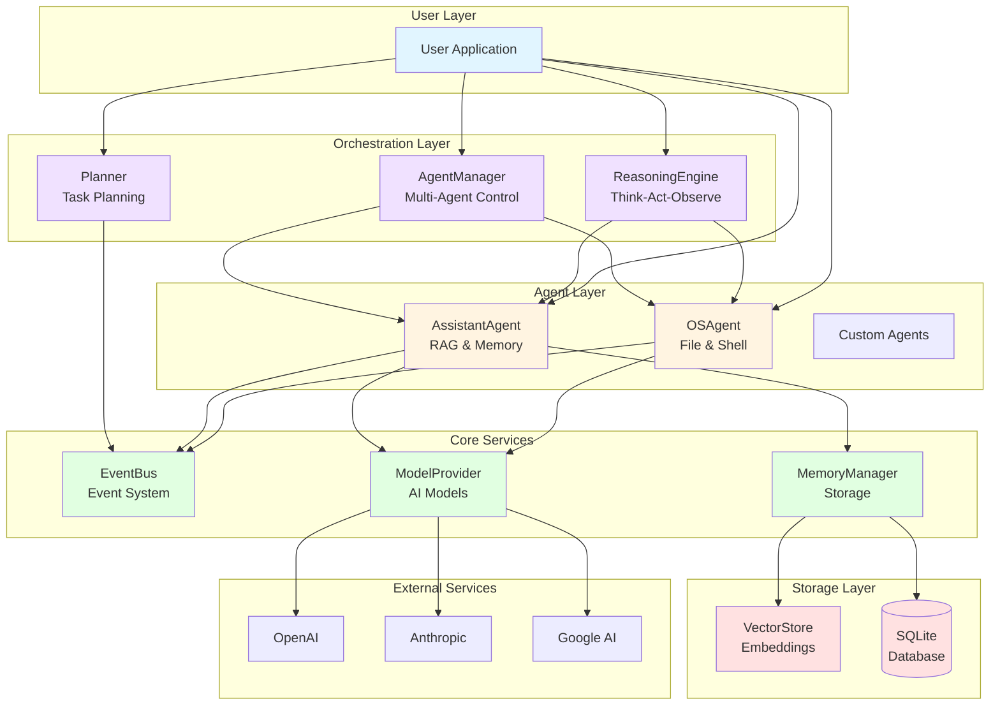

---

## 🔄 Complete Request-Response Flow

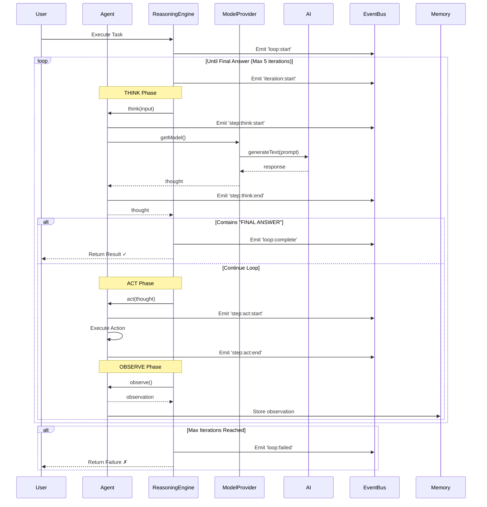

---

## 🎯 Execution Mode Comparison

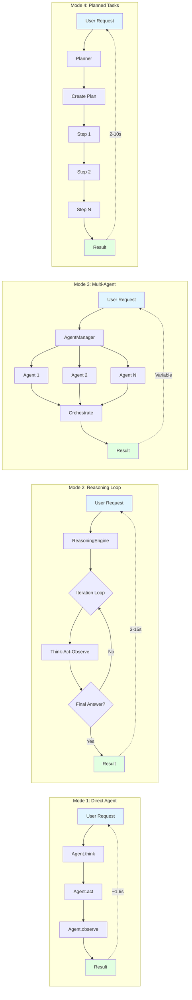

---

## 🧠 OSAgent Detailed Flow

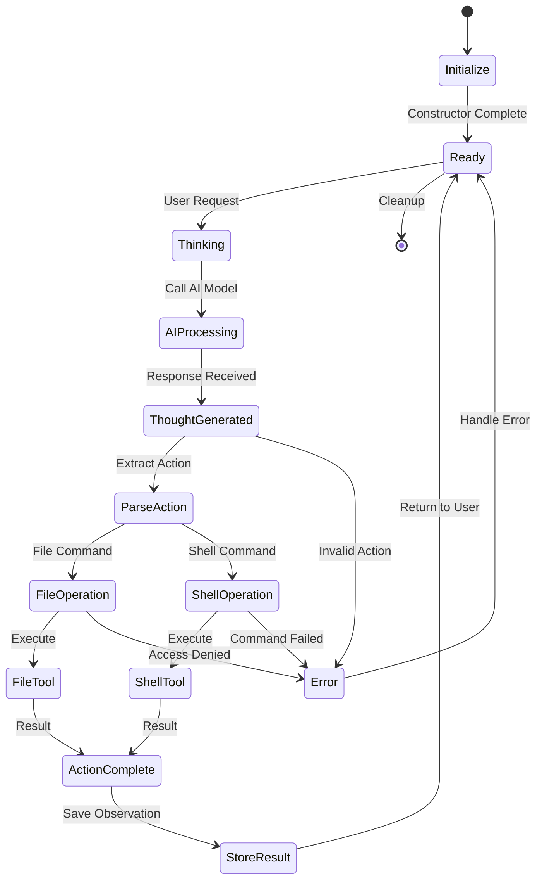

---

## 💾 AssistantAgent RAG Flow

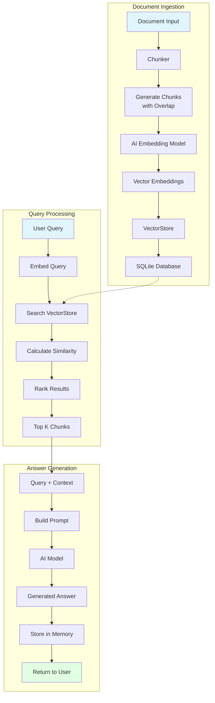

---

## ⏱️ Timeline Visualization

```mermaid
gantt
    title Operone System Execution Timeline
    dateFormat X
    axisFormat %Lms
    
    section Initialization
    ModelProvider Init       :0, 10
    MemoryManager Init      :10, 20
    EventBus Init          :20, 10
    Agent Creation         :30, 40
    System Ready           :70, 10
    
    section Think Phase
    User Request           :100, 10
    Agent.think() Start    :110, 10
    AI Model Call          :120, 1000
    Think Complete         :1120, 10
    
    section Act Phase
    Agent.act() Start      :1130, 10
    Execute Action         :1140, 100
    Act Complete           :1240, 10
    
    section Observe Phase
    Agent.observe()        :1250, 20
    Store Result           :1270, 30
    Return to User         :1300, 10
```

---

## 🔄 Event Bus Message Flow

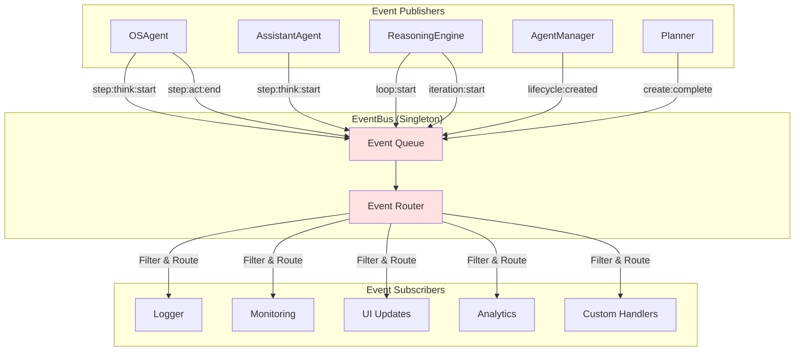

---

## 📋 Planner Execution Flow

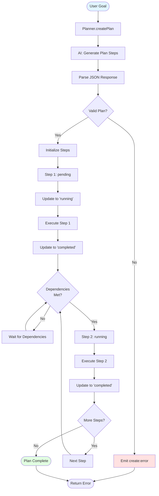

---

## 🎭 Multi-Agent Orchestration

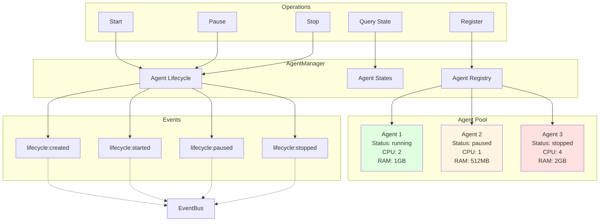

---

## 💡 Memory System Architecture

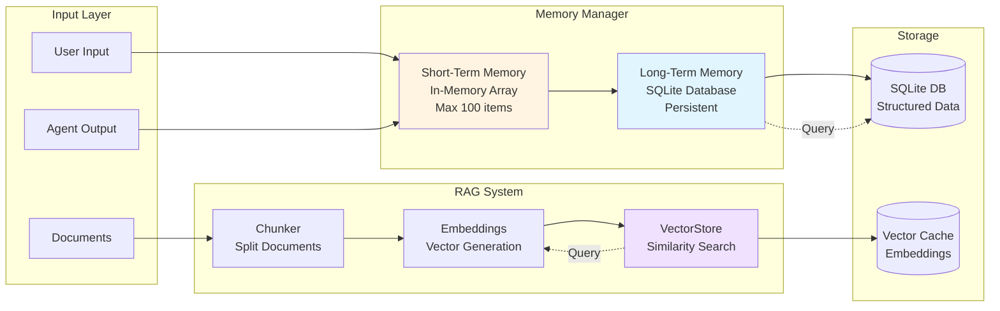

---

## 🔍 Think-Act-Observe Loop Detail

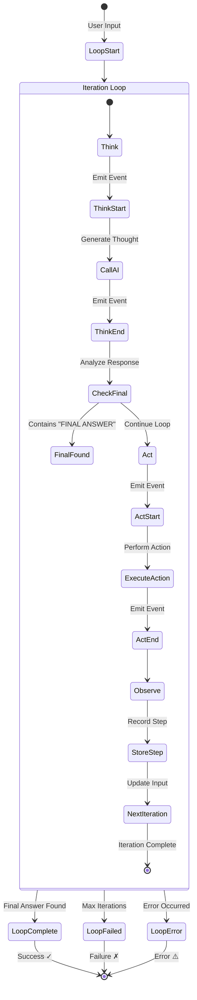

---

## 📊 Performance Metrics Dashboard

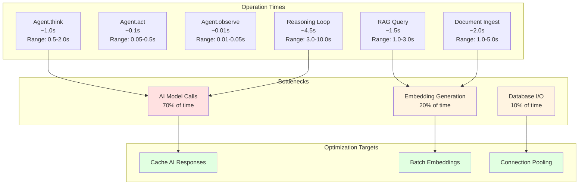

---

## 🌊 Data Flow: End-to-End Example

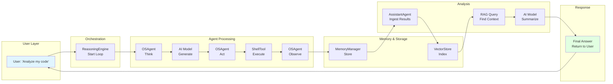

---

## 🎨 Component Interaction Matrix

| Component | Calls → | EventBus | ModelProvider | MemoryManager | VectorStore | AI Model |
|-----------|---------|----------|---------------|---------------|-------------|----------|
| **OSAgent** | ✓ | ✓ | ✓ | ✗ | ✗ | via Provider |
| **AssistantAgent** | ✓ | ✓ | ✓ | ✓ | ✓ | via Provider |
| **ReasoningEngine** | ✓ | ✓ | ✗ | ✗ | ✗ | via Agent |
| **AgentManager** | ✓ | ✓ | ✗ | ✗ | ✗ | ✗ |
| **Planner** | ✓ | ✓ | ✓ | ✗ | ✗ | via Provider |
| **RAGEngine** | ✗ | ✗ | ✗ | ✓ | ✓ | via Provider |
| **MemoryManager** | ✗ | ✗ | ✗ | ✗ | ✓ | ✗ |

---

## 🚀 Quick Reference: Common Patterns

### Pattern 1: Simple Query
```
User → OSAgent.think() → AI Model → OSAgent.act() → Result
Duration: ~1.6s
```

### Pattern 2: Autonomous Task
```
User → ReasoningEngine → Loop[Think→Act→Observe] → Final Answer
Duration: ~4.5s (3 iterations)
```

### Pattern 3: Knowledge Query
```
User → AssistantAgent.ingest() → VectorStore → AssistantAgent.think() → AI + Context → Answer
Duration: ~3.5s (2s ingest + 1.5s query)
```

### Pattern 4: Multi-Step Plan
```
User → Planner.create() → AI Plan → Execute Steps → Update Status → Complete
Duration: ~2s (plan) + execution time
```

---

## 📈 Scaling Considerations

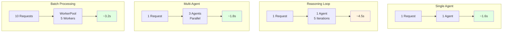

---

## 🔗 Related Documentation

- **[Usage Guide](./USAGE_GUIDE.md)** - How to implement these patterns
- **[API Contract](./API_CONTRACT.md)** - Detailed API specifications
- **[Project Report](./PROJECT_REPORT.md)** - System architecture
- **[Known Issues](./KNOWN_ISSUES.md)** - Troubleshooting

---

## 💡 Understanding the Diagrams

### Color Coding
- 🔵 **Blue** - User inputs/requests
- 🟢 **Green** - Successful outputs/completions
- 🟡 **Yellow** - Processing/in-progress states
- 🔴 **Red** - Errors/failures
- 🟣 **Purple** - Orchestration components

### Timing Notation
- `T0` - Start time (0ms)
- `T0+Xms` - X milliseconds after start
- `~Xs` - Approximate duration in seconds

### Symbol Legend
- `→` - Synchronous call
- `-.->` - Asynchronous/event-driven
- `[*]` - Start/end state
- `{}` - Decision point
- `()` - Terminal state
